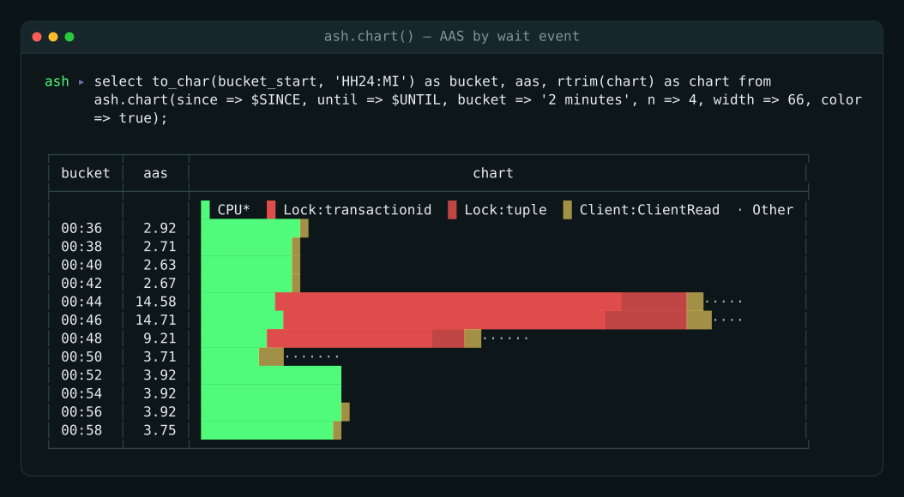
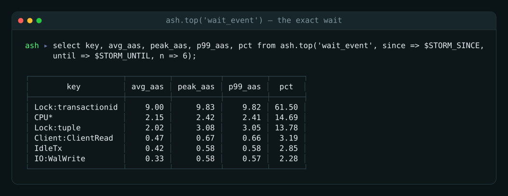

# pg_ash: Active Session History for Postgres

[](https://github.com/NikolayS/pg_ash/actions/workflows/test.yml)
[](https://github.com/NikolayS/pg_ash)
[](LICENSE)
[](https://github.com/NikolayS/pg_ash)

pg_ash is Active Session History (ASH) for Postgres, implemented in plain SQL and PL/pgSQL.

pg_ash samples `pg_stat_activity`, stores compact wait-event history in the
database, and lets you answer "what was happening then?" after the problem is
gone. It works on managed Postgres because it is not a C extension: no
`shared_preload_libraries`, no provider approval, no restart.

## Why pg_ash

Postgres has excellent current-state views, but almost no built-in memory. If a
lock storm ended ten minutes ago, `pg_stat_activity` cannot tell you who waited,
when it peaked, or which query carried the load. pg_ash keeps that history
inside Postgres and exposes it as AAS: average active sessions.

Use pg_ash when you need:

- incident reconstruction after the spike is gone
- wait-event timelines without external agents
- query attribution through `pg_stat_statements`
- long-term AAS trends through rollups
- a tool that can run on RDS, Cloud SQL, AlloyDB, Supabase, Neon, and similar
  managed platforms

## Quick start

The current `main` branch contains the 2.0 beta 1 SQL in `sql/`.

```sql
create extension if not exists pg_stat_statements;

\i sql/ash-install.sql

select ash.start('1 second');

select * from ash.periods();
select * from ash.top('wait_event_type');
select * from ash.top('query_id');
select * from ash.chart(since => now() - interval '5 minutes', color => true);
```

## Color output

pg_ash can render compact terminal charts with ANSI colors when `color => true`
or `set ash.color = on` is used.



`ash.chart()` — Average Active Sessions per minute, stacked by wait event, in
24-bit color straight out of `psql`. The glyph varies per series (`█ ▓ ░ ▒ ·`)
as well as the color, so the ranking still reads correctly for colorblind
viewers and in a monochrome terminal.



`ash.top('wait_event')` — the wait-event breakdown for the incident window,
ranked by Average Active Sessions, with the share of total active time. When
`Lock:transactionid` dominates, the database is not short of capacity — writers
are queueing behind one another's row locks.

Every image above is real `ash.*` output over real samples, regenerated with
`make -C demos stills`. See [demos/README.md](demos/README.md).

For the latest stable v1.5 tag, check out `v1.5` first and use:

```sql
\i sql/ash-install.sql
```

## Upgrade to 2.0

2.0 is a breaking reader-API release. Upgrade scripts are cumulative; run the
missing scripts in order.

```sql
\i sql/migrations/ash-1.0-to-1.1.sql
\i sql/migrations/ash-1.1-to-1.2.sql
\i sql/migrations/ash-1.2-to-1.3.sql
\i sql/migrations/ash-1.3-to-1.4.sql
\i sql/migrations/ash-1.4-to-1.5.sql
\i sql/migrations/ash-1.5-to-2.0.sql

select * from ash.status() where metric = 'version';
-- version | 2.0-beta1
```

The old root-level upgrade paths, such as `sql/ash-1.5-to-2.0.sql`, are kept as
compatibility wrappers. New docs and scripts should use `sql/migrations/`.

The old 1.x reader functions are gone in 2.0:

| 1.x | 2.0 |
|---|---|
| `top_waits`, `top_by_type` | `top('wait_event')`, `top('wait_event_type')` |
| `top_queries`, `top_queries_with_text` | `top('query_id')` |
| `wait_timeline` | `timeline(...)` |
| `timeline_chart` | `chart(...)` |
| `activity_summary` | `summary(...)` |
| `query_waits(q)` | `top('wait_event', query_id => q)` |
| `event_queries(e)` | `top('query_id', wait_event => e)` |
| `samples_by_database` | `top('database')` |

Full mapping: [`blueprints/AAS_EXAMPLES.md`](blueprints/AAS_EXAMPLES.md).

## Reader API

Start with `ash.periods()`, then drill down with `ash.timeline()` and `ash.top()`.
Every reader reports its data source: `raw`, `rollup_1m`, `rollup_1h`, or
`none`.

| Function | Use it for |
|---|---|
| `ash.periods([until])` | Standard trailing windows: 1m, 5m, 1h, 1d, 1w, 1mo |
| `ash.aas(since, until, filters..., [bucket])` | Scalar AAS for one window |
| `ash.timeline(since, until, [bucket], filters...)` | AAS time series |
| `ash.top(dimension, since, until, filters..., [n], [bucket], [order_by])` | Top waits, queries, databases, or wait classes |
| `ash.compare(since_1, until_1, since_2, until_2, [dimension], filters...)` | Before/after diff |
| `ash.samples(since, until, [n], filters...)` | Decoded raw samples |
| `ash.report(since, until, [vcpus], [n])` | Machine-readable JSON report |
| `ash.chart(since, until, [bucket], [n], [width], [color])` | Human ASCII AAS chart |
| `ash.summary(since, until)` | Human key/value summary |

Filters are consistent where they apply:

- `wait_event_type => 'IO'`
- `wait_event => 'IO:DataFileRead'`
- `query_id => 8231004856741017`
- `database => 'appdb'`

`ash.top()` dimensions are:

- `wait_event_type`
- `wait_event`
- `query_id`
- `database`

`order_by` is `avg`, `peak`, or `p99`. During incidents, `order_by => 'peak'`
is usually the right first cut because it surfaces short spikes that averages
hide.

## Investigation flow

### 1. Is it bad now, or was it a spike?

```sql
select * from ash.periods();
```

Typical output:

```text
 period | source    | bucket   | buckets_with_data | avg_aas | peak_aas | p99_aas
--------+-----------+----------+-------------------+---------+----------+---------
 1m     | raw       | 00:01:00 |                 1 |    2.2  |     2.4  |    2.4
 5m     | raw       | 00:01:00 |                 5 |    5.1  |    12.0  |   11.4
 1h     | rollup_1m | 00:01:00 |                60 |    2.6  |    12.0  |    4.8
```

`peak_aas` far above `avg_aas` means a short storm. Both high means sustained
load.

### 2. What kind of wait dominated?

```sql
select *
from ash.top(
  'wait_event_type',
  since => now() - interval '5 minutes',
  order_by => 'peak'
);
```

```text
 key    | query_text | source | avg_aas | peak_aas | p99_aas | backend_seconds | pct
--------+------------+--------+---------+----------+---------+-----------------+------
 Lock   |            | raw    |    4.6  |    12.0  |   11.2  |            4180 | 68.4
 CPU*   |            | raw    |    1.1  |     2.0  |    1.9  |             830 | 20.0
 IO     |            | raw    |    0.4  |     1.0  |    0.9  |             290 |  7.0
```

`CPU*` means active backends with no reported wait event. The asterisk matters:
it can be real CPU or an uninstrumented Postgres path.

### 3. When did it land?

```sql
select *
from ash.timeline(
  since => now() - interval '10 minutes',
  bucket => '1 minute',
  wait_event_type => 'Lock'
);
```

Use the busiest bucket as the next drill window.

### 4. Which query caused it?

```sql
select *
from ash.top(
  'query_id',
  since => now() - interval '5 minutes',
  wait_event => 'Lock:tuple',
  order_by => 'peak',
  n => 5
);
```

Then reverse the drill-down:

```sql
select *
from ash.top(
  'wait_event',
  since => now() - interval '5 minutes',
  query_id => 8231004856741017
);
```

Combining a query filter with a wait filter requires the raw wait-to-query link. If
the window is past raw retention, pg_ash raises with the raw-retention boundary
instead of returning a fake empty result.

### 5. Pull raw evidence

```sql
select *
from ash.samples(
  since => now() - interval '10 minutes',
  n => 20
);
```

Dump a wider incident window with psql:

```sql
\copy (
  select *
  from ash.samples(
    since => '2026-02-14 03:00',
    until => '2026-02-14 03:05',
    n => 10000000
  )
) to '/tmp/ash-incident.csv' csv header
```

## Chart rendering

`ash.chart()` is for humans. `ash.timeline()` is the typed-data companion.

```sql
select bucket_start, aas, detail, chart
from ash.chart(
  since => now() - interval '5 minutes',
  bucket => '1 minute',
  n => 4,
  width => 50
);
```

Enable ANSI color per call:

```sql
select *
from ash.chart(
  since => now() - interval '1 hour',
  color => true
);
```

psql's aligned formatter escapes ANSI bytes. Add this to `.psqlrc` for colored
terminal output:

```sql
\set color '\\g | sed ''s/\\\\x1B/\\x1b/g'' | less -R'
```

Then run:

```sql
select * from ash.chart(since => now() - interval '1 hour', color => true) :color
```

## Machine report

`ash.report()` returns one JSONB payload for monitoring and health-assessment
systems.

```sql
select ash.report(
  since => now() - interval '1 day',
  vcpus => 16
);
```

It includes:

- `aas_avg`, `aas_worst1m`, `aas_p99`, `aas_p999`
- wait classes: `total`, `cpu`, `io`, `ipc`, `lock`, `lwlock`
- top wait events and top query IDs for extreme minutes
- `top_queryids_available`, so scrapers can branch without guessing
- `coverage`, so consumers can reconcile against `ash.aas()` and `ash.top()`

The payload contract is stable for the 2.0 minor line: keys may be added, not
renamed or removed.

## Admin API

| Function | Purpose |
|---|---|
| `ash.start([every])` | Enable sampling and schedule jobs when pg_cron is available |
| `ash.stop()` | Disable sampling and unschedule pg_cron jobs |
| `ash.status()` | Health, version, retention, partition, scheduler, and rollup state |
| `ash.take_sample()` | Take one sample manually; normally called by the scheduler |
| `ash.rotate()` | Rotate raw partitions and roll up endangered samples |
| `ash.rebuild_partitions(n, 'yes')` | Recreate raw partitions; destructive for raw samples |
| `ash.rollup_minute([batch])` | Fold raw samples into `rollup_1m` |
| `ash.rollup_hour()` | Fold minute rollups into `rollup_1h` |
| `ash.rollup_cleanup()` | Delete expired rollup rows |
| `ash.set_debug_logging([bool])` | Toggle sampler debug logging |
| `ash.grant_reader(role)` | Grant the monitoring-reader bundle |
| `ash.revoke_reader(role)` | Revoke the monitoring-reader bundle |
| `ash.uninstall('yes')` | Drop pg_ash and unschedule jobs |

All destructive calls require the exact `'yes'` confirmation token.

## Scheduling

pg_cron is optional. With pg_cron installed, `ash.start('1 second')` schedules:

- sampling
- raw partition rotation
- minute and hour rollups
- rollup cleanup

Without pg_cron, `ash.start()` records the intended interval and prints the
external jobs to schedule. The minimum useful external loop is:

```bash
while true; do
  psql -qAtX -d mydb -c "set statement_timeout = '500ms'; select ash.take_sample();"
  sleep 1
done
```

Also schedule maintenance:

```bash
0 0 * * * psql -qAtX -d mydb -c "select ash.rotate();"
* * * * * psql -qAtX -d mydb -c "select ash.rollup_minute();"
0 * * * * psql -qAtX -d mydb -c "select ash.rollup_hour();"
0 3 * * * psql -qAtX -d mydb -c "select ash.rollup_cleanup();"
```

At 1-second sampling, pg_cron `cron.job_run_details` can grow by about
12 MiB/day. Prefer:

```sql
alter system set cron.log_run = off;
```

This requires a restart because `cron.log_run` is postmaster-context.

## Retention and storage

Raw samples use a PGQ-style ring of partitions. Defaults:

- `num_partitions = 3`
- `rotation_period = '1 day'`
- readable raw retention is roughly `(num_partitions - 2) * rotation_period`
- `rollup_1m` retention is 30 days
- `rollup_1h` retention is 5 years

Increase raw retention:

```sql
select ash.stop();
select ash.rebuild_partitions(9, 'yes');
select ash.start();
```

`rebuild_partitions()` drops all raw samples and query-map partitions. Rollups
survive. Re-run `ash.grant_reader()` for monitoring roles afterward because
new partitions need fresh grants.

Typical storage at 1-second sampling:

| Active backends | Raw storage/day | Default raw on disk |
|---:|---:|---:|
| 10 | 11 MiB | 22 MiB |
| 50 | 30 MiB | 60 MiB |
| 100 | 50 MiB | 100 MiB |
| 500 | 245 MiB | 490 MiB |

Rollups add about 120 MiB per database for 5 years of trend data.

## Privileges

Install and run sampling as a role that can read stats:

```sql
grant pg_read_all_stats to ash_owner;
```

`pg_stat_activity.query_id` is visible only for activity owned by the current
role unless the sampler has `pg_read_all_stats`. Without it, other users'
activity collapses into unattributed `query_id = NULL` load.

The installer grants reader access to `pg_monitor` by default when possible.
For another monitoring role:

```sql
create role grafana login password '...';
select ash.grant_reader('grafana');
```

`ash.grant_reader()` deliberately does not grant admin functions, and it does
not grant `pg_read_all_stats`. Monitoring roles that need `query_text` from
`pg_stat_statements` usually need membership in `pg_monitor` or
`pg_read_all_stats` too.

If `pg_stat_statements` is installed after pg_ash, or moved to another schema:

```sql
select ash._apply_pgss_search_path();
```

## Catalog docs

pg_ash documents itself in the database:

```sql
select obj_description('ash'::regnamespace);
select obj_description(
  'ash.top(text,timestamptz,timestamptz,text,text,bigint,name,int,interval,text)'::regprocedure
);
```

This is intentional: agents and monitoring tools can discover the reader
surface from the catalog alone.

## Requirements

- Postgres 14+
- `pg_stat_statements` optional but recommended for `query_text`
- `pg_cron` optional but recommended for built-in scheduling

`compute_query_id` must be on for useful query attribution:

```sql
alter system set compute_query_id = 'on';
select pg_reload_conf();
```

## Compared to alternatives

| | pg_ash | pg_wait_sampling / pgsentinel | External sampling |
|---|---|---|---|
| Install | `\i` SQL | C extension + restart | Agent and storage |
| Managed Postgres | Yes | Usually no | Yes, with effort |
| History survives restart | Yes | No | Depends |
| Query with SQL | Yes | Yes | Usually no |
| Storage | In database | Memory ring | External |
| Sampling frequency | Usually 1s | Usually 10ms | Usually 15-60s |

pg_ash is not a replacement for in-process 10ms samplers when you control the
server and need sub-second detail. It is for durable, portable ASH on managed
Postgres.

## Known limits

- Primary only: pg_ash writes sample and rollup rows.
- It samples one database installation but sees activity from all databases.
- `query_text` is best-effort through `pg_stat_statements`; pg_ash stores
  `query_id`, not historical SQL text.
- The query map is capped at 50k entries per slot; volatile SQL comments can
  exhaust it faster on older Postgres versions.
- Parallel workers share the leader query ID and count as separate active
  backends.
- 1-second sampling generates WAL, roughly 29 KiB/sample in the current
  benchmark.
- `sample_ts` is `int4` seconds since 2026-01-01 UTC; the horizon is around
  2094. `ash.status()` exposes remaining epoch seconds.
- Advisory-lock squat DoS is possible for roles that can intentionally hold
  pg_ash's advisory locks. See
  [SECURITY.md](SECURITY.md#advisory-lock-squat-dos).

## Development

CI discovers install and upgrade paths from the repository:

```bash
python3 devel/scripts/ash_sql_chain.py fresh-install-path
python3 devel/scripts/ash_sql_chain.py full-upgrade-chain
```

Run the experimental demo recorder:

```bash
cd demos
make record
```

## License

[Apache 2.0](LICENSE)

pg_ash is part of SAMO: self-driving Postgres.
